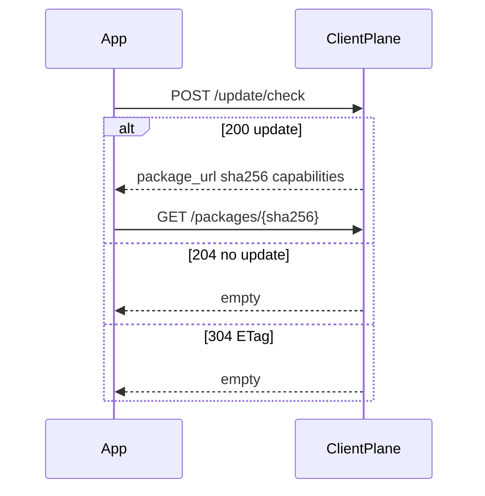

# 检查更新

仅 **POST** `/api/v1/projects/{project_ref}/update/check`。GET 同路径 404。

必填 JSON：`current_version`、`os`、`arch`。可选：`channel`、`hw_rev`、`os_version`、`device_id`、`capabilities[]`、`accepted_delta_algos[]`。默认能力仅 `full_package`。

| 状态 | 含义 |
|------|------|
| 200 | 有目标；体无 changelog 正文 |
| 204 | 无更新，不是错误 |
| 304 | ETag 命中 |
| 409 | 如 `NO_SAFE_TARGET` / `MIN_OS_NOT_MET` / `INTERMEDIATE_UNAVAILABLE` |

```bash
curl -sS -X POST 'http://127.0.0.1:8080/api/v1/projects/my-app/update/check' \
  -H 'Content-Type: application/json' \
  -d '{"current_version":"1.0.0","os":"windows","arch":"x86_64","channel":"stable","device_id":"app-stable-id","capabilities":["full_package"]}'
```

预期：200 JSON 或空 body 的 204。完整 schema：[API 参考](/api/reference/) 中的 `openapi.client.json`（<a href="/api/scalar/client" target="_blank" rel="noopener">新窗口打开 Scalar</a>）。


