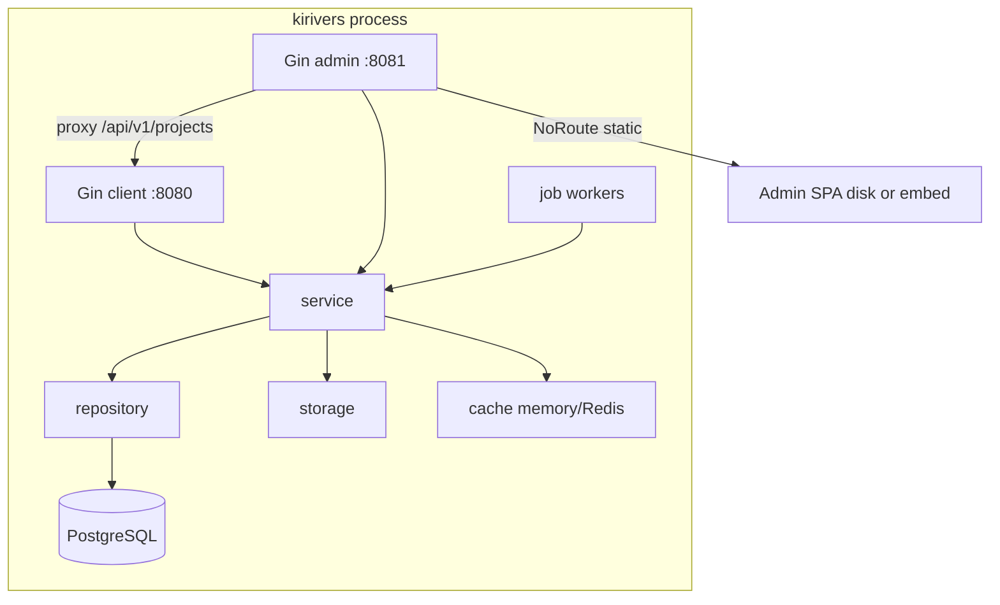

# 运行架构

`main.go` → `cmd.Run()`。默认 `server`：单进程双监听。装配顺序：三 YAML → logger → postgres → storage → cache → 双 Gin → job worker。

- 客户端平面默认 `:8080`（更新 / 商店 / 遥测）。
- 管理平面默认 `:8081`（控制台 + CI Agent）。`admin.enabled=false` **只**关闭管理监听。
- 管理平面 **反代** `/api/v1/projects/**` 到本进程客户端平面（空 `ClientProxyURL` 仅测试）。

管理台：`NoRoute`，禁止 `gin.Static`。`frontend/embed.go` 为 `//go:embed all:dist`。优先级：非空 `static_dir` 且磁盘有 `index.html` → 磁盘；否则内嵌 FS 有 `index.html` → embed；`static_dir: ""` → 关 UI。

探活路径 `/api/v1/health`；`/api/v1/ready` 未注册。`ready` 不含 Redis。缓存启动 fail-closed vs 运行时回退。五路日志；双 sink 全关则不监听。`ApplyTrustedProxies`：空列表 `SetTrustedProxies(nil)`。

