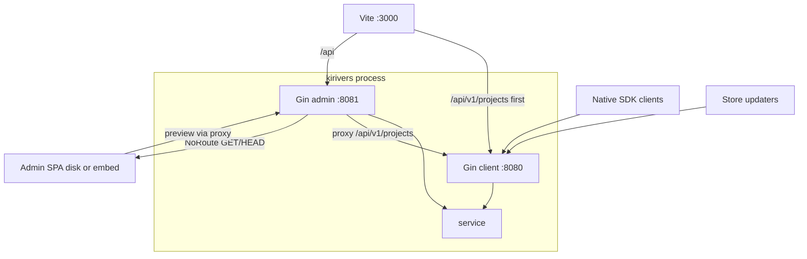
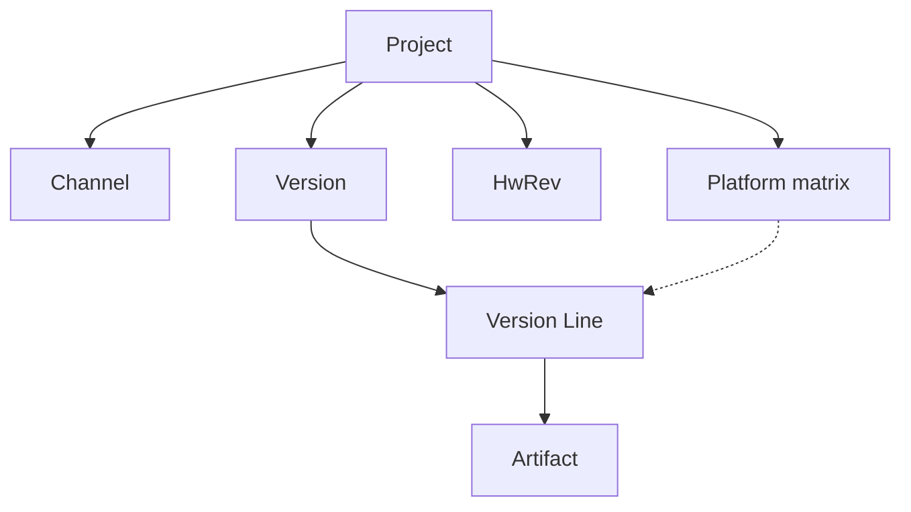
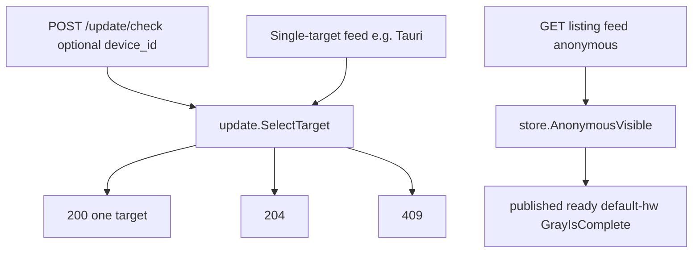

# 技术白皮书

## 摘要

KiriVers 是自托管的**更新目录与分发**进程：一份 PostgreSQL 目录，两个 HTTP 平面。客户端平面（默认 `:8080`）对软件客户端提供原生 JSON 与九种商店 feed；管理平面（默认 `:8081`）托管 Vue 管理台 SPA 与 CI。两条客户端协议共享 `internal/service/update.SelectTarget` 选目标口径（列表型 feed 经 `AnonymousVisible` 投影，禁止分叉）。

发布单位是 **Version**（整数构建号与 SemVer 双编号、changelog、渠道、LTS / 关键 / 灰度）。可下载切片是 **Version Line**：同一 Version 在 `(os, arch)` 上的行，**没有自己的版本号**。产物键 `{slug}/{sha256}`；浏览器上传 `direct_s3` 恒为 `false`。

本页是改默认分支前的**域模型**：对象分层、唯一实现点、必须保持 404 的 leftover。运维步骤见功能指南；包树与启动链见 [运行架构](./architecture)。

## 问题与定位

要解决的是：把**二进制安装包、固件镜像或多文件目录**按渠道与平台发给已安装的客户端，并在需要时走差量或打包，而不是用 git 做源码协作。

| 在范围内 | 不在范围内 |
|----------|------------|
| 自托管目录、原生 check / 下载、商店 feed、灰度 allowlist、管理台与 CI 发版 | git 托管、代码评审、CI 构建农场 |
| 单文件二进制差量、多文件 integrity + 动态打包 | 各商店上架审核、系统软件源 |
| 公开对象存储上的产物；私有后端上的 GeoIP | 用管理平面 `GET /` 托管本站文档 |

不是 git。不上架 App Store / Play / Microsoft Store。不是 APT / RPM / Flatpak 源。官方 SDK 只封装原生 JSON，不读 feed。

## 运行形态

一个 `kirivers` / `kirivers server` 进程、两套 Gin。装配顺序：三份 YAML → logger → PostgreSQL → storage → cache → 双 Gin → job worker（细节 [运行架构](./architecture)）。

| 平面 | 默认地址 | 职责 |
|------|----------|------|
| 客户端 | `:8080` | `POST .../update/check`、changelog、pack、商店 listing、遥测、公告 |
| 管理 | `:8081` | SPA、管理 CRUD、CI `POST .../ci/releases` |

管理平面在 `ClientProxyURL` 已设置时，把 `/api/v1/projects/**` **反代**到本进程客户端监听。空 `ClientProxyURL` 仅测试：这些路径在管理面是 JSON `NOT_FOUND`。Vite 开发代理必须把 `/api/v1/projects` 写在 `/api` **之前**。

管理台文件：Gin **NoRoute**（`frontend/embed.go` `//go:embed all:dist`）。禁止 `gin.Static` / `StaticFS`。优先级：非空 `static_dir` 且磁盘有 `index.html` → 磁盘；否则内嵌 FS 有 `index.html` → embed；`static_dir: ""` → 关 UI。

探活只有 `GET /api/v1/health`。健康 JSON 里的 `ready` 探 PostgreSQL 与对象存储，**不含** Redis。`GET /api/v1/ready` 未注册。

## 对象模型

身份：`uuid`、`slug`、未过期别名是 `project_ref`。控制台 `name` 是 Unicode 标题，**不是** `project_ref`，也不出现在客户端 `ProjectPublic`、check 或 feed。

`internal/model` 分层（不展开包树）：

| 类型 | 含义 |
|------|------|
| `Project` | 目录根；`compare_engine`、`device_id` 策略、存储前缀 |
| `Channel` | 渠道 slug、`stability_rank`、unlisted、可选 `X-Channel-Token` |
| 平台矩阵 | `(os, arch)` 行；该对首次发布后 `package_type` 锁定 |
| `HwRev` | 硬件代号；feed / 匿名 check 用默认变体 |
| `Version` | 双编号、changelog、渠道、LTS / 关键 / 灰度、`min_source_version` |
| `VersionLine` | `(version, os, arch)` 切片；`min_os` / `min_api_level` 在线上，不在矩阵列 |
| `Artifact` | `full` / `store_full` / `delta` / `patch` / `file`；键 `{slug}/{sha256}` |

Version **拥有** changelog、渠道、LTS、关键、灰度。Version Line **没有**独立版本号。

## 版本身份与比较

每个 Version 可同时有整数构建号与 SemVer。项目 `compare_engine` 为 `integer` 或 `semver`，决定排序与选目标；另一个编号只作显示与协议映射。`+build` **不参与**唯一性与顺序。首次 **published** 之后引擎不可改（`COMPARE_ENGINE_IMMUTABLE`）。

解析 `current_version`（`ParseVersionRef`）：全数字 → 整数身份；否则 SemVer 2.0，去掉前导 `v` 与 `+build`。无法解析 → 400 `ENGINE_MISMATCH`，**不得**当成 `0`。能解析但目录中没有 → 404 `VERSION_NOT_FOUND`。定位到 Version 之后，比较**只**看 `compare_engine`。

商店 adapter 按协议固定映射两个编号（例如 Sparkle 的 `sparkle:version` 与 `sparkle:shortVersionString`），**不**跟显示键或 `compare_engine` 走。协议字段见 [商店适配器](./store)。

管理台列表卡片的 `latest_version` 走 `update.CompareVersions`（published + deprecated），**禁止**调用 `SelectTarget`。

## 两条客户端协议

1. **原生 JSON**（官方 SDK 唯一路径）：`POST /api/v1/projects/:ref/update/check`。请求体必填 `current_version`、`os`、`arch`；可选 `channel`、`hw_rev`、`os_version`、`device_id`、`capabilities`、`accepted_delta_algos`。能力位：`full_package` / `file_list` / `patch_package` / `binary_delta`。未声明时只广告 `full_package`。遗留查询 `protocol_version` **忽略**；无协议头。`GET .../update/check` 未注册（404，无 301）。
2. **商店 feed**：listing 作用域 `GET .../store/{protocol}/{listing_slug}/{doc}`。九种 adapter：`sparkle`、`electron`、`tauri`、`squirrel`、`clickonce`、`appimage`、`winget`、`msix`、`fdroid`。缺 listing slug 为**纯文本 404**。SDK **不**读 feed。HTTP 与 enclosure 规则见 [商店适配器](./store)。

原生 check 调用 `SelectTarget`。列表型 feed 用 `store.AnonymousVisible` 投影**同一匿名口径**（无 `device_id`、默认 `hw_rev`、仅 `GrayIsComplete`），不得另写选目标；单目标动态端点（如 Tauri）直接调用 `SelectTarget`。

Check **不是** CDN 对象：200/204 使用 `private, max-age=0, must-revalidate`（含匿名且灰度已完成）。`cache_s_maxage_seconds` **不**作用在 check。

::: danger 错误
`GET /api/v1/projects/:ref/update/check` 作为现行检查更新方法。
:::

::: tip 正确
`POST /api/v1/projects/:ref/update/check`。遗留 GET 保持未注册 404。
:::

::: danger 错误
`GET /api/v1/projects/:ref/store/sparkle/appcast.xml`（无 listing slug）。
:::

::: tip 正确
`GET /api/v1/projects/:ref/store/{protocol}/{listing_slug}/{doc}`。缺 listing 纯文本 404。
:::

## 目标选择与生命周期

Version 状态：`draft` → `published` → `deprecated` / `revoked`。`draft` 对客户端不可见。`deprecated` 不作为自动升级目标，但仍可查询或下载。`revoked` 禁止下载，允许安全降级。`is_lts` 可事后设置。`is_critical` 发布即 `GrayIsComplete`，不能进灰度。

Version Line 就绪后才进入目录。`packs_ready_at` 由系统 `auto_delta` 预热（渠道 × `delta_source_count`）盖戳；未盖戳 → check / feed `VERSION_NOT_VISIBLE`。客户端动态打包 **不得**改写该戳。

**原生**选目标的唯一实现：`internal/service/update.SelectTarget`（`select.go`）。列表型 feed 走 `store.AnonymousVisible`（同源匿名口径，不跑完整 SelectTarget）。公告匹配与管理台 latest **禁止**调用 `SelectTarget`。

Hop：只读 `Version.MinSourceVersion`。胜者是比较键最高的候选；若当前低于该胜者的门槛，沿 `min_source` 链改写目标（Published + 就绪线 + hw + 渠道允许），最多 **8** 跳。缺失 / 未就绪 / 环 / 超过 8 → 409 `INTERMEDIATE_UNAVAILABLE`。**不要**跳过被门槛挡住的最新候选去选次高版本。

当前线自身的 `min_os` / `min_api_level` 未满足 → 409 `MIN_OS_NOT_MET`（`lineMeetsOS`，只读 Version Line 列）。候选级不满足则静默跳过。目录中未知的 `current_version` → 404 `VERSION_NOT_FOUND`。吊销且无安全目标 → 409 `NO_SAFE_TARGET`。无更新 → **204**（仍带 ETag）。

## 渠道、Token 与灰度

系统渠道 `stability_rank`：alpha 10、beta 20、stable 30。跨渠道只允许升到更稳（或同级按比较键）。Unlisted：仅当客户端**当前**渠道 slug 或查询 `channel=` 等于该 slug 时可用，否则跳过，不 404 整次 check。

`X-Channel-Token` 与项目 `X-Project-Token` 不同。Token 保护渠道：头不匹配则 `channelAllowedForUpgrade` **跳过该渠道**，其它公开渠道仍可 200；没有其它更新则 204。Check 上错误 Token **不是** 401/403。明文不得进 ETag、日志或缓存键。Changelog 路径上 Token 不匹配是 404。

原生带 `device_id` 的灰度命中：`grayHitFor` = allowlist，直到 `Version.GrayIsComplete()`（`is_critical` 或 `gray_completed_at`）。旋钮 `gray_start_percent` / `gray_step_percent` / `gray_interval_seconds` 经 `GrayCoverage` 计算目标名册规模并驱动 admission 补员，**不**进入 `grayHitFor`。空名册立即完成。`pkg/grayutil` 是遗留包，check **不得**调用。匿名与 feed **只**看 `GrayIsComplete`；未完成的灰度对 Sparkle / electron 等不可见。

::: danger 错误
用 HMAC 百分比桶决定灰度是否命中。
:::

::: tip 正确
有 `device_id`：allowlist，直至 `GrayIsComplete`。匿名 / feed：只看 `GrayIsComplete`。
:::

## 产物与增量

下载 URL 的唯一构造：`update.PackageDownloadURL` → `/api/v1/projects/{slug}/packages/{64-hex}`（单节点或 `cluster.download=local`）。集群 S3-direct 时同一助手改为公开 `{slug}/{sha256}` 对象 URL。Feed enclosure 必须用同一助手。JSON `file_name` 是未签名显示名。`GET /artifacts/{id}/{filename}` 未注册。

单文件差量能力 `binary_delta`：`internal/delta` 三种算法（bsdiff、xdelta3、hdiffpatch）。服务端 `hdiffpatch` 经 CGO 链接 libHDiffPatch，生成未压缩 `HDIFF13&`，运行时不 exec PATH 上的 CLI。`bsdiff` / `xdelta3` 仍为纯 Go。Magic 与分流见 [差量引擎](./delta)。Go SDK 仍 `CGO_ENABLED=0`。

多文件：客户端先 integrity，再 `POST /update/pack`（入队与轮询同一 URL）。未压缩 Manifest 合计超过 `dynamic_pack.max_bytes`，或 needed 体积相对全量 Manifest 过大 → HTTP **200** `status=full_package`，不是 400，也不把管理 `job_id` 暴露给客户端。原生 hash-root zip 是 `kind=full`；商店 `line_full` 必须是 `kind=store_full`（路径 zip）。多文件线缺少 `store_full` 则跳过该版本，**禁止**拿 `full` 冒充 `line_full`。

浏览器预签名 `direct_s3` 恒为 `false`；禁止对未知 S3 键裸 PUT。

## 日志、公告与媒体

原生 changelog **只**在 `GET .../changelog/:channel/:os/:arch`。Check 200 **没有** `changelog` / `changelog_versions`。Check 的目录 ETag 不含 Version changelog 正文。路径 channel 必填；Token 不匹配 → 404。Markdown `${site_url}` 按 **RequestOrigin** 展开（忽略 Referer）。

公告是独立资源：`GET .../announcements`，匹配函数只有 `announcementMatches`（七种合法 scope，Version 绑 UUID）。空匹配是 200 `{announcements:[]}`，不是 204。禁止写入 check / changelog / feed，也禁止用 `SelectTarget` 决定公告。公告 `${site_url}` 仍按 Referer 展开。

媒体：管理上传进 `storage.Backend`（`media/…`）；客户端按 UUID 公开 GET。文档里不放预签名 URL。

::: danger 错误
在 check 200 正文里带 `changelog` 或 `changelog_versions`。
:::

::: tip 正确
changelog 走 `GET .../changelog/:channel/:os/:arch`。公告走独立 GET。
:::

## 存储、CDN 与集群

进程有两类对象后端：

| 后端 | 键 | 用途 |
|------|-----|------|
| 公开 | `{slug}/{sha256}` | 安装包、差量、patch、商店 zip |
| 私有 | `geoip/{id}/…` | GeoIP MMDB；禁止写到公开桶 |

管理 API 把项目 `storage_visibility` **锁成** `public`；PATCH `private` → 400。代码里仍可能有历史 private 行与 local-proxy 路径，控制台没有「私有托管产物」开关。

Check 响应不得当作公开 CDN 对象（见上节 Cache-Control）。`ClusterActive` = `storage.driver=s3` **且** `cache.driver=redis`。local-proxy（`cluster.download=local`）下 check 与 feed 使用 `private, no-store`，避免把节点副本可见性送进共享 CDN。`GET /packages` 优先本地副本。

`/health` 的 `ready`：DB Ping + 公开（及已打开的私有）后端 Head `.ready`。Redis 运行时回退不是 `ready=false`。

## 管理平面、CI 与控制台

四类凭据不要混用：实例 / 平台管理员会话（2FA / Passkey）、项目成员、CI Token（`POST .../ci/releases`）、项目 Token（客户端 `require_client_token`）。渠道 Token 只跳过渠道，不是项目鉴权。

控制台是域表面，不是第二套协议。CRUD 走管理平面 SDK（`@/api/generated`）。check / integrity / 公告**预览**走客户端平面 SDK（`@/api/generated-client`），经管理监听上的 `/api/v1/projects/**` 反代。不要再造第三个 HTTP 客户端。

域规则：

- 控制台 `name` ≠ `project_ref`。
- 版本写入 `changelog_i18n`；不得丢掉额外 locale 键。
- 灰度 UI：GET allowlist（`client_ids`）+ 旋钮，不是百分比 HMAC 控件。
- 预览 check 是 **POST** `checkUpdate`。Integrity 对话框没有 limit 控件。
- `direct_s3` 恒 false。
- 平台 combobox 使用 slug ∪ `COMMON_*`，不用 `entry.name` 当 os/arch。

操作步骤与 SFC / yarn 日常循环见 [管理台前端](./frontend)。平台管理员表面：admins、GeoIP、nodes、security；项目表面：总览、设置、渠道、矩阵、hw-revs、语言、公告、Token、发版、审计、客户端、版本与灰度。

## 鉴权、签名与隐私

JSON 错误走 `pkg/response` 信封 `error.code`。商店缺 listing **例外**：纯文本 404，不是该信封。

原生响应签名（`pkg/signature.SignPayload`）覆盖 `integer`、`semver`、`root_hash`、`package_url`、`size`、`sha256` 字段，不是文件字节。Sparkle `edSignature` 是 enclosure **文件字节**上的 Ed25519，与原生 payload 签名不是同一条。

`device_id` 策略：`hashed`（默认，入库为项目 `DeviceSecret` 派生的摘要）、`raw`（不推荐）、`none`（不插 `clients` 行，等同缺 `device_id`；空名册使灰度直接完成）。摘要密钥不出现在任何 API JSON。应用日志只写 Fingerprint，不写原始 `device_id`。

在线是 `POST .../clients/report` → `{ip, country_code, region_code, geo_i18n}`。遗留 `POST .../clients/login` 保持 404。`device_id_policy=none` 时 report 为 400。

## 官方 SDK 边界

每种语言一条孤儿分支 `sdk/<lang>`，在**独立 git worktree** 里维护。Go / PHP / Swift 的 `sdk/go` 等是指针 README；完整源码在 `sdk/go-src` / `sdk/php-src` / `sdk/swift-src`，再同步到独立发布仓。默认分支 **没有** `sdk/` 目录，也不合并任何 `sdk/*`。

SDK 只封装原生 JSON。语言 agent **不得**改默认分支（含 `internal/`）；若服务端行为错误，在语言 worktree 写 `BACKEND_ISSUE.md`。安装坐标见 [API → SDK](/api/sdk/)。维护者分支规则见 [SDK 源码分支](./sdk)。

## 明确非范围与禁止复活

产品不做：git 替代、封闭商店审核、APT/RPM/Flatpak、再写一套更新器、把文档站挂在管理 `GET /`、未合并的进程内 CGO 差量。

禁止分叉的实现点：

| 不变量 | 唯一 owner | 禁止 |
|--------|------------|------|
| 原生选目标 | `update.SelectTarget` | 列表 feed 另写过滤；公告匹配；列表卡片 latest |
| 列表 feed 投影 | `store.AnonymousVisible` | adapter 内自写可见性；调用完整 `SelectTarget` 当列表 |
| 列表卡片 latest | `update.CompareVersions`（published+deprecated） | `SelectTarget` |
| 原生灰度命中 | allowlist 直至 `Version.GrayIsComplete` | `pkg/grayutil`、HMAC、`rollout_percent` |
| Check 渠道 Token | 跳过渠道，从不 401/403 | 把错误 `X-Channel-Token` 当鉴权失败 |
| 公告匹配 | `announcementMatches` | 写入 check；调用 `SelectTarget` |
| 原生 changelog | `GET .../changelog/:channel/:os/:arch` | check 200 的 `changelog*` |
| 产物 HTTP URL | `update.PackageDownloadURL` | `/artifacts/{id}/{filename}`；未知键 PresignPut |
| Feed enclosure | 与 check 同一助手 | adapter 自建 URL |
| 商店 `line_full` | `kind=store_full` | hash-root `kind=full` |
| 原生打包超限 | 200 `status=full_package` | 400；客户端看到管理 `job_id` |
| JSON 错误 | `pkg/response` | 商店缺 listing（纯文本 404） |
| 管理台文件 | NoRoute；`frontend/embed.go` | `gin.Static` / `StaticFS` |
| OpenAPI | `openapi.admin.json` / `openapi.client.json` | 手改 `generated*` |
| SPA 客户端预览 | `@/api/generated-client` + `/api/v1/projects/**` 反代 | 第三个 HTTP 客户端 |

必须保持未注册（404，无 301）的 leftover：

| 路径 | 现行替代 |
|------|----------|
| `GET .../update/check` | `POST .../update/check` |
| `POST .../clients/login` | `POST .../clients/report`（仅 geo 四字段） |
| `/store/{protocol}/{doc}`（无 listing slug） | `/store/{protocol}/{listing_slug}/{doc}` |
| `GET /api/v1/ready` | `GET /api/v1/health`（`ready` 在 JSON 内，不含 Redis） |

POST check 上遗留查询 `protocol_version` 忽略，不要重新做成协商头。

## 延伸阅读

| 页 | 内容 |
|----|------|
| [运行架构](./architecture) | 启动链、NoRoute、`/api/v1/projects` 反代、探活 |
| [后端分层](./backend) | controller / service / repository |
| [管理台前端](./frontend) | 双 SDK、Vite 代理、yarn 循环 |
| [差量引擎](./delta) | 三种算法与 magic |
| [商店适配器](./store) | 九协议 HTTP 与 enclosure |
| [OpenAPI 契约](./openapi) | 两份平面 JSON |
| [SDK 源码分支](./sdk) | `sdk/<lang>` worktree |
| 功能指南 | [渠道](/guide/features/channels)、[灰度](/guide/features/gray)、[增量](/guide/features/incremental) 等运维步骤 |
| [API → SDK](/api/sdk/) | 语言安装 |
| 仓库 `.trellis/spec/` | 贡献者可执行契约（不是安装文档） |
