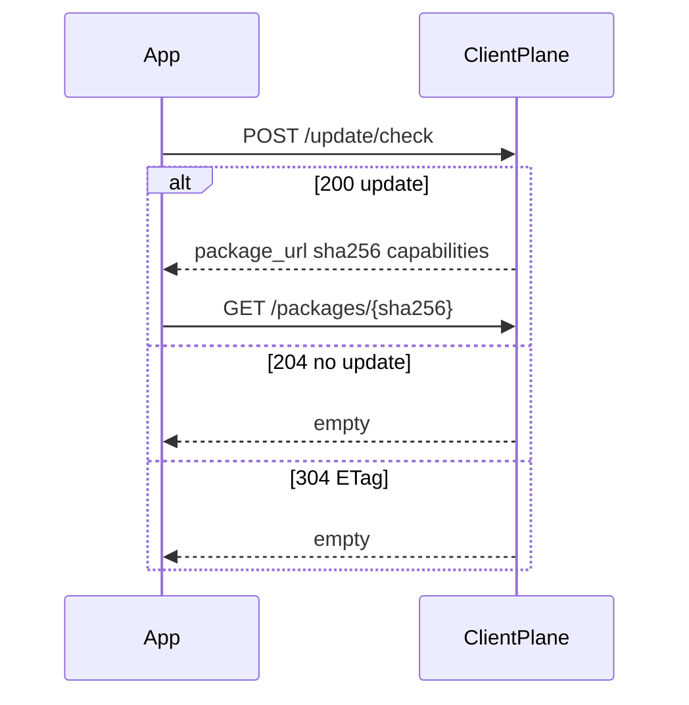

# Update check

**POST** only: `/api/v1/projects/{project_ref}/update/check`. GET is 404.

Required JSON: `current_version`, `os`, `arch`. Optional: `channel`, `hw_rev`, `os_version`, `device_id`, `capabilities[]`, `accepted_delta_algos[]`. Default capability is `full_package`.

| Status | Meaning |
|--------|---------|
| 200 | Target found; no changelog text |
| 204 | No update; not an error |
| 304 | ETag hit |
| 409 | e.g. `NO_SAFE_TARGET` / `MIN_OS_NOT_MET` / `INTERMEDIATE_UNAVAILABLE` |

```bash
curl -sS -X POST 'http://127.0.0.1:8080/api/v1/projects/my-app/update/check' \
  -H 'Content-Type: application/json' \
  -d '{"current_version":"1.0.0","os":"windows","arch":"x86_64","channel":"stable","device_id":"app-stable-id","capabilities":["full_package"]}'
```

Expect 200 JSON or 204 with an empty body. Schema: [API reference](/en/api/reference/) (`openapi.client.json`; <a href="/en/api/scalar/client" target="_blank" rel="noopener">open Scalar</a>).


