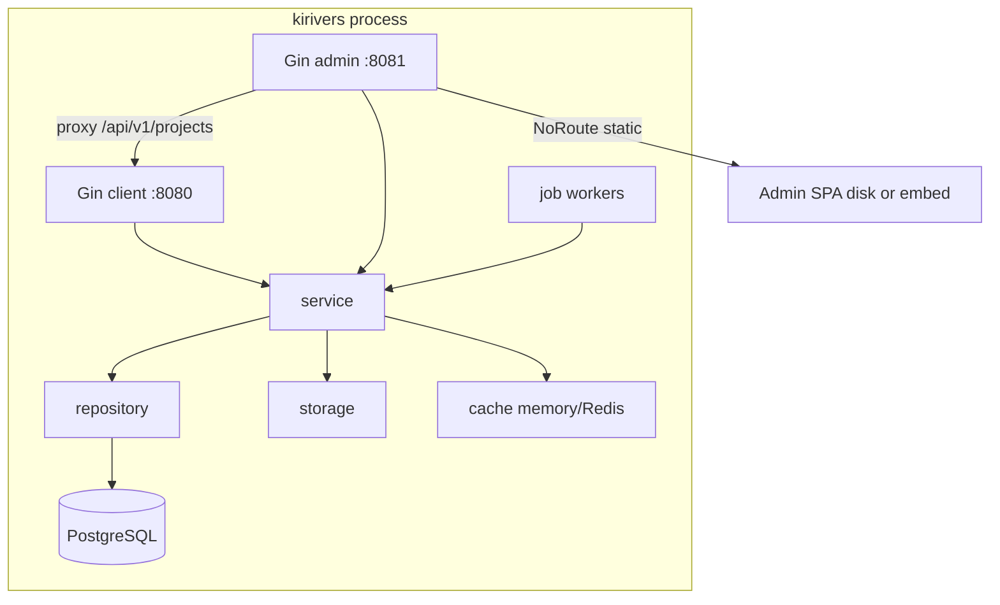

# Runtime architecture

`main.go` → `cmd.Run()`. Default `server`: one process, two listeners. Boot: three YAML files → logger → postgres → storage → cache → dual Gin → job workers.

- Client plane default `:8080` (updates / store / telemetry).
- Admin plane default `:8081` (console + CI agent). `admin.enabled=false` skips the **admin listener only**.
- Admin **reverse-proxies** `/api/v1/projects/**` to this process’s client plane (empty `ClientProxyURL` is tests only).

Admin UI: `NoRoute`, never `gin.Static`. `frontend/embed.go` is `//go:embed all:dist`. Priority: non-empty `static_dir` with disk `index.html` → disk; else embedded FS with `index.html` → embed; `static_dir: ""` → UI off.

Probe `/api/v1/health`; `/api/v1/ready` is unregistered. `ready` excludes Redis. Cache: fail-closed at start, runtime fallback. Five log streams; both sinks off refuses listen. `ApplyTrustedProxies`: empty list `SetTrustedProxies(nil)`.

