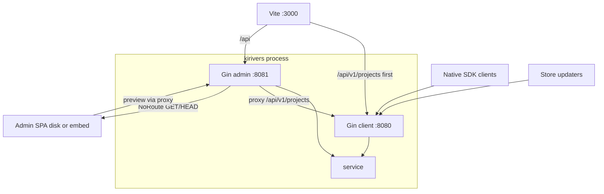
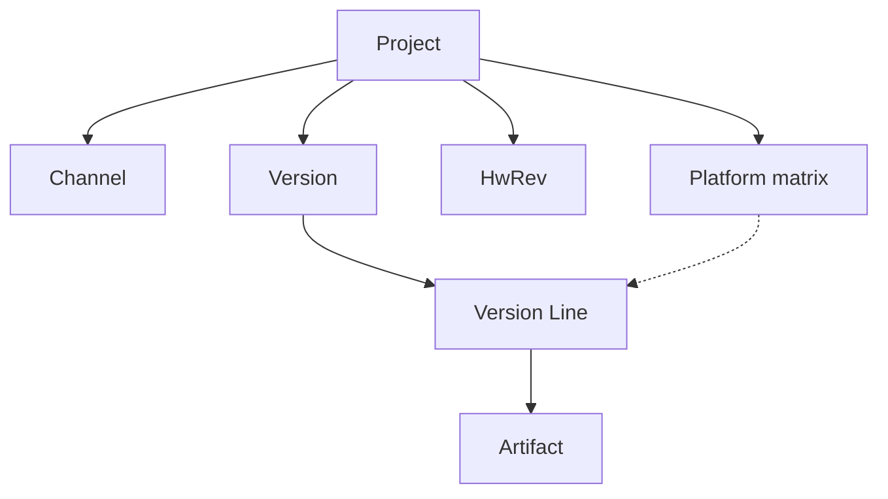
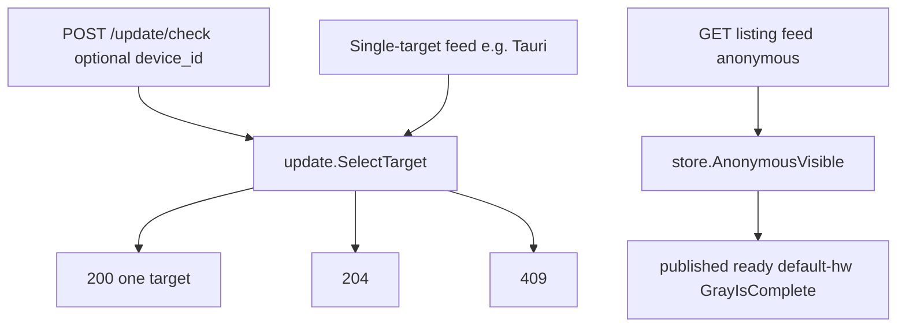

# Technical whitepaper

## Abstract

KiriVers is a self-hosted **update catalog and delivery** process: one PostgreSQL catalog, two HTTP planes. The client plane (default `:8080`) serves native JSON and nine store feeds to software clients. The admin plane (default `:8081`) hosts the Vue admin SPA and CI. Both client protocols share `internal/service/update.SelectTarget` as the targeting owner (list feeds project via `AnonymousVisible`; do not fork).

The release unit is a **Version** (dual integer and SemVer numbers, changelog, channel, LTS / critical / gray). The downloadable slice is a **Version Line**: that Version on one `(os, arch)` pair, **with no version number of its own**. Artifact keys are `{slug}/{sha256}`. Browser uploads keep `direct_s3` false.

This page is the **domain model** for default-branch work: object layering, unique implementation owners, leftovers that must stay 404. Operator steps live in the feature guides. Process boot lives in [Runtime architecture](./architecture).

## Problem and positioning

The problem is shipping **binary installers, firmware images, or multi-file directories** by channel and platform to installed clients, with optional delta or packing — not using git for source collaboration.

| In scope | Out of scope |
|----------|--------------|
| Self-hosted catalog, native check / download, store feeds, gray allowlist, admin console and CI release | Git hosting, code review, a CI build farm |
| Single-file binary delta; multi-file integrity plus dynamic packing | Store review queues; distro repositories |
| Public-backend artifacts; private-backend GeoIP | Hosting this documentation site on admin `GET /` |

Not git. Not App Store / Play / Microsoft Store review. Not APT / RPM / Flatpak. Official SDKs wrap native JSON only and do not read feeds.

## Runtime shape

One `kirivers` / `kirivers server` process, two Gin engines. Boot order: three YAML files → logger → PostgreSQL → storage → cache → dual Gin → job workers (detail: [Runtime architecture](./architecture)).

| Plane | Default addr | Role |
|-------|--------------|------|
| Client | `:8080` | `POST .../update/check`, changelog, pack, store listings, telemetry, announcements |
| Admin | `:8081` | SPA, admin CRUD, CI `POST .../ci/releases` |

When `ClientProxyURL` is set, the admin plane **reverse-proxies** `/api/v1/projects/**` to this process’s client listener. Empty `ClientProxyURL` is tests only: those paths are JSON `NOT_FOUND` on admin. The Vite dev proxy must list `/api/v1/projects` **before** `/api`.

Admin UI files: Gin **NoRoute** (`frontend/embed.go` `//go:embed all:dist`). Never `gin.Static` / `StaticFS`. Priority: non-empty `static_dir` with disk `index.html` → disk; else embedded FS with `index.html` → embed; `static_dir: ""` → UI off.

The only probe is `GET /api/v1/health`. JSON `ready` probes PostgreSQL and object storage, **not** Redis. `GET /api/v1/ready` is unregistered.

## Object model

Identity: `uuid`, `slug`, and unexpired aliases are `project_ref`. Console `name` is a Unicode title; it is **not** `project_ref` and does not appear on client `ProjectPublic`, check, or feeds.

`internal/model` layers (not a package tree):

| Type | Meaning |
|------|---------|
| `Project` | Catalog root; `compare_engine`, `device_id` policy, storage prefix |
| `Channel` | Channel slug, `stability_rank`, unlisted, optional `X-Channel-Token` |
| Platform matrix | `(os, arch)` rows; `package_type` locks after first publish on that pair |
| `HwRev` | Hardware id; feeds and anonymous check use the default variant |
| `Version` | Dual numbers, changelog, channel, LTS / critical / gray, `min_source_version` |
| `VersionLine` | `(version, os, arch)` slice; `min_os` / `min_api_level` live on the line, not matrix columns |
| `Artifact` | `full` / `store_full` / `delta` / `patch` / `file`; key `{slug}/{sha256}` |

Version **owns** changelog, channel, LTS, critical, and gray. A Version Line **has no** version number of its own.

## Version identity and comparison

Each Version may hold both an integer build and a SemVer. Project `compare_engine` is `integer` or `semver` and decides ordering and targeting; the other number is display and protocol mapping. `+build` **does not** participate in uniqueness or order. The engine is immutable after the first **published** version (`COMPARE_ENGINE_IMMUTABLE`).

Parsing `current_version` (`ParseVersionRef`): all digits → integer identity; otherwise SemVer 2.0 with leading `v` and `+build` stripped. Unparseable → 400 `ENGINE_MISMATCH`, **never** treated as `0`. Parsed but missing from the catalog → 404 `VERSION_NOT_FOUND`. After locate, comparison uses **only** `compare_engine`.

Store adapters map both numbers with a **fixed per-protocol** table (for example Sparkle `sparkle:version` vs `sparkle:shortVersionString`), not via a display key or `compare_engine`. Protocol fields: [Store adapters](./store).

Admin list-card `latest_version` uses `update.CompareVersions` over published + deprecated. It **must not** call `SelectTarget`.

## Two client protocols

1. **Native JSON** (the only official SDK path): `POST /api/v1/projects/:ref/update/check`. Required body: `current_version`, `os`, `arch`. Optional: `channel`, `hw_rev`, `os_version`, `device_id`, `capabilities`, `accepted_delta_algos`. Capabilities: `full_package` / `file_list` / `patch_package` / `binary_delta`. Undeclared clients advertise `full_package` only. Leftover query `protocol_version` is **ignored**; there is no protocol header. `GET .../update/check` is unregistered (404, no 301).
2. **Store feeds**: listing-scoped `GET .../store/{protocol}/{listing_slug}/{doc}`. Nine adapters: `sparkle`, `electron`, `tauri`, `squirrel`, `clickonce`, `appimage`, `winget`, `msix`, `fdroid`. Missing listing slug is **plain-text 404**. SDKs **do not** read feeds. HTTP and enclosure rules: [Store adapters](./store).

Native check calls `SelectTarget`. List feeds project the **same anonymous rules** through `store.AnonymousVisible` (no `device_id`, default `hw_rev`, `GrayIsComplete` only) and must not fork targeting. Single-target dynamic endpoints (Tauri) call `SelectTarget` directly.

Check is **not** a CDN object: 200/204 use `private, max-age=0, must-revalidate` (including anonymous complete gray). `cache_s_maxage_seconds` does **not** apply to check.

::: danger Wrong
`GET /api/v1/projects/:ref/update/check` as the live update-check method.
:::

::: tip Correct
`POST /api/v1/projects/:ref/update/check`. Leftover GET stays unregistered 404.
:::

::: danger Wrong
`GET /api/v1/projects/:ref/store/sparkle/appcast.xml` (no listing slug).
:::

::: tip Correct
`GET /api/v1/projects/:ref/store/{protocol}/{listing_slug}/{doc}`. Missing listing is plain-text 404.
:::

## Target selection and lifecycle

Version statuses: `draft` → `published` → `deprecated` / `revoked`. `draft` is invisible to clients. `deprecated` is not an automatic upgrade target but remains queryable/downloadable. `revoked` forbids download and allows a safe downgrade. `is_lts` may be set later. `is_critical` publish is `GrayIsComplete` and cannot enter gray.

A Version Line enters the catalog only when ready. `packs_ready_at` is stamped by system `auto_delta` preheat (channel × `delta_source_count`). Unstamped → check / feed `VERSION_NOT_VISIBLE`. Client dynamic pack jobs **must not** write that stamp.

The **native** target implementation is `internal/service/update.SelectTarget` (`select.go`). List feeds project through `store.AnonymousVisible` (same anonymous filter, not a full `SelectTarget` run). Announcement matching and admin list-card latest **must not** call `SelectTarget`.

Hop: `Version.MinSourceVersion` only. The winner is the highest compare-key candidate; if current is below that winner’s floor, rewrite along the `min_source` chain (Published + ready line + hw + channel allowed), max **8** hops. Missing / not-ready / cycle / more than 8 → 409 `INTERMEDIATE_UNAVAILABLE`. **Do not** skip the blocked newest candidate to pick the next-highest.

Current line’s own `min_os` / `min_api_level` unmet → 409 `MIN_OS_NOT_MET` (`lineMeetsOS`, Version Line columns only). Candidate-level failure is a silent skip. A `current_version` that parses but is not in the catalog → 404 `VERSION_NOT_FOUND`. Revoked with no safe target → 409 `NO_SAFE_TARGET`. No update → **204** (still ETag-able).

## Channels, tokens, and gray

System `stability_rank`: alpha 10, beta 20, stable 30. Cross-channel upgrades only move to a stabler (or same-rank, then compare-key) channel. Unlisted: usable when the client’s **current** channel slug or query `channel=` equals that slug; otherwise skip, do not 404 the whole check.

`X-Channel-Token` is not project `X-Project-Token`. Token-protected channel: mismatch makes `channelAllowedForUpgrade` **skip that channel**; other public channels may still 200; otherwise 204. A wrong token on check is **not** 401/403. Plaintext must not enter ETag, logs, or cache keys. Changelog path mismatch is 404.

Native gray with `device_id`: `grayHitFor` = allowlist until `Version.GrayIsComplete()` (`is_critical` or `gray_completed_at`). Knobs `gray_start_percent` / `gray_step_percent` / `gray_interval_seconds` feed `GrayCoverage` (desired namebook size) and admission; they **do not** enter `grayHitFor`. An empty namebook completes immediately. `pkg/grayutil` is leftover; check **must not** call it. Anonymous clients and feeds see **only** `GrayIsComplete`; incomplete gray never appears on Sparkle / electron / ….

::: danger Wrong
Decide gray hits with an HMAC percent bucket.
:::

::: tip Correct
With `device_id`: allowlist until `GrayIsComplete`. Anonymous / feeds: `GrayIsComplete` only.
:::

## Artifacts and incremental updates

The only download URL builder is `update.PackageDownloadURL` → `/api/v1/projects/{slug}/packages/{64-hex}` (single-node or `cluster.download=local`). With cluster S3-direct the same helper emits the public `{slug}/{sha256}` object URL. Feed enclosures must use that helper. JSON `file_name` is an unsigned display name. `GET /artifacts/{id}/{filename}` is unregistered.

Single-file `binary_delta`: three algorithms in `internal/delta` (bsdiff, xdelta3, hdiffpatch). Server `hdiffpatch` CGO-links libHDiffPatch and emits uncompressed `HDIFF13&`; it does not exec a PATH CLI. `bsdiff` / `xdelta3` stay pure Go. Magics and dispatch: [Delta engines](./delta). The Go SDK stays `CGO_ENABLED=0`.

Multi-file: clients run integrity, then `POST /update/pack` (enqueue and poll the same URL). Uncompressed Manifest totals over `dynamic_pack.max_bytes`, or a needed-size ratio that is too large versus the full Manifest → HTTP **200** `status=full_package`, not 400, and not an admin `job_id` on the client pack API. Native hash-root zip is `kind=full`. Store `line_full` must be `kind=store_full` (path zip). A multi-file line without `store_full` is skipped; **never** serve hash-root `full` as `line_full`.

Browser presign keeps `direct_s3` false; never PUT unknown S3 keys.

## Changelog, announcements, and media

Native changelog lives **only** at `GET .../changelog/:channel/:os/:arch`. Check 200 has **no** `changelog` / `changelog_versions`. The check catalog ETag omits Version changelog text. Path channel is required; token mismatch → 404. Markdown `${site_url}` expands from **RequestOrigin** (ignore Referer).

Announcements are a separate resource: `GET .../announcements`, matched only by `announcementMatches` (seven legal scopes, Version bound by UUID). Empty match is 200 `{announcements:[]}`, not 204. Do not embed them in check / changelog / feeds, and do not call `SelectTarget` to match notices. Announcement `${site_url}` still expands from Referer.

Media: admin uploads go to `storage.Backend` (`media/…`); client GET is UUID-public. Stored Markdown must not embed presigned URLs.

::: danger Wrong
Put `changelog` or `changelog_versions` on the check 200 body.
:::

::: tip Correct
Changelog is `GET .../changelog/:channel/:os/:arch`. Announcements are a dedicated GET.
:::

## Storage, CDN, and cluster

The process has two object backends:

| Backend | Keys | Use |
|---------|------|-----|
| Public | `{slug}/{sha256}` | Installers, deltas, patches, store zips |
| Private | `geoip/{id}/…` | GeoIP MMDB; never Put on the public bucket |

Admin write **locks** project `storage_visibility` to `public`; PATCH `private` → 400. Legacy private rows and local-proxy paths may still exist in code; the console has no “host artifacts privately” switch.

Check responses must not be treated as public CDN objects (Cache-Control above). `ClusterActive` = `storage.driver=s3` **and** `cache.driver=redis`. Under local-proxy (`cluster.download=local`), check and feeds use `private, no-store` so per-node replica visibility does not enter a shared CDN. `GET /packages` prefers the local replica.

`/health` `ready`: DB Ping plus Head of `.ready` on the public (and, if open, private) backend. Redis runtime failover is not `ready=false`.

## Admin plane, CI, and console

Do not mix four credential kinds: instance / platform-admin session (2FA / Passkey), project members, CI token (`POST .../ci/releases`), project token (client `require_client_token`). Channel tokens skip a channel; they are not project auth.

The console is a domain surface, not a second protocol. CRUD uses the admin-plane SDK (`@/api/generated`). Check / integrity / announcement **preview** uses the client-plane SDK (`@/api/generated-client`) through the admin listener’s reverse proxy of `/api/v1/projects/**`. Do not invent a third HTTP client.

Domain rules:

- Console `name` is not `project_ref`.
- Version writes use `changelog_i18n`; extra locale map keys must not be dropped.
- Gray UI: GET allowlist (`client_ids`) plus knobs, not a percent-HMAC control.
- Check preview is **POST** `checkUpdate`. The integrity dialog has no limit control.
- `direct_s3` is always false.
- Platform comboboxes use slug ∪ `COMMON_*`, never `entry.name` as stored os/arch.

Operator steps and the yarn / SFC loop: [Admin frontend](./frontend). Platform-admin surfaces: admins, GeoIP, nodes, security. Project surfaces: overview, settings, channels, matrix, hw-revs, languages, announcements, tokens, release, audit, clients, version + gray.

## Auth, signing, and privacy

JSON errors use the `pkg/response` envelope `error.code`. Store missing listing is the **exception**: plain-text 404, not that envelope.

Native response signing (`pkg/signature.SignPayload`) covers `integer`, `semver`, `root_hash`, `package_url`, `size`, `sha256` fields — not file bytes. Sparkle `edSignature` is Ed25519 over enclosure **file bytes**, a different signature from the native payload.

`device_id` policies: `hashed` (default; stored digest from project `DeviceSecret`), `raw` (discouraged), `none` (do not insert a `clients` row — same as missing `device_id`; an empty namebook completes gray). The digest key never appears in API JSON. Application logs write Fingerprint only, never raw `device_id`.

Presence is `POST .../clients/report` → `{ip, country_code, region_code, geo_i18n}`. Leftover `POST .../clients/login` stays 404. Report with `device_id_policy=none` is 400.

## Official SDK boundary

Each language lives on an orphan branch `sdk/<lang>` in a **separate git worktree**. Go / PHP / Swift `sdk/go` (and siblings) are pointer READMEs; full sources live on `sdk/go-src` / `sdk/php-src` / `sdk/swift-src` and then dedicated publish remotes. The default branch has **no** `sdk/` tree and must not merge any `sdk/*`.

SDKs wrap native JSON only. Language agents **must not** edit the default-branch tree (including `internal/`); if the server is wrong they write `BACKEND_ISSUE.md` in the language worktree. Install coordinates: [API → SDK](/en/api/sdk/). Maintainer branch rules: [SDK source branches](./sdk).

## Out of scope and leftovers that must stay unregistered

The product does not replace git, closed-store review, APT/RPM/Flatpak, a second updater binary, hosting this docs site on admin `GET /`, or unpublished in-process CGO delta.

Unique owners (do not fork):

| Invariant | Unique owner | Must not |
|-----------|--------------|----------|
| Native target | `update.SelectTarget` | Forking list-feed filters; announcement matching; list-card latest |
| List-feed projection | `store.AnonymousVisible` | Adapter-local visibility; using full `SelectTarget` as a list |
| List-card latest | `update.CompareVersions` (published+deprecated) | `SelectTarget` |
| Native gray hit | Allowlist until `Version.GrayIsComplete` | `pkg/grayutil`, HMAC, `rollout_percent` |
| Channel token on check | Skip channel, never 401/403 | Treating wrong `X-Channel-Token` as auth failure |
| Announcement match | `announcementMatches` | Embedding in check; calling `SelectTarget` |
| Native changelog | `GET .../changelog/:channel/:os/:arch` | Check 200 `changelog*` |
| Artifact HTTP URL | `update.PackageDownloadURL` | `/artifacts/{id}/{filename}`; unknown-key PresignPut |
| Feed enclosure | Same helper as check | Adapter-local URL builders |
| Store `line_full` | `kind=store_full` | Hash-root `kind=full` |
| Native pack oversize | 200 `status=full_package` | 400; exposing admin `job_id` on client pack |
| JSON errors | `pkg/response` | Store missing listing (plain-text 404) |
| Admin UI files | NoRoute; `frontend/embed.go` | `gin.Static` / `StaticFS` |
| OpenAPI | `openapi.admin.json` / `openapi.client.json` | Hand-editing `generated*` |
| SPA client-plane preview | `@/api/generated-client` + `/api/v1/projects/**` proxy | A third HTTP client |

Leftover HTTP that must stay unregistered (404, no 301):

| Path | Live replacement |
|------|------------------|
| `GET .../update/check` | `POST .../update/check` |
| `POST .../clients/login` | `POST .../clients/report` (geo four fields only) |
| `/store/{protocol}/{doc}` (no listing slug) | `/store/{protocol}/{listing_slug}/{doc}` |
| `GET /api/v1/ready` | `GET /api/v1/health` (`ready` inside JSON, excludes Redis) |

Leftover query `protocol_version` on POST check is ignored; do not revive it as a negotiation header.

## Further reading

| Page | Content |
|------|---------|
| [Runtime architecture](./architecture) | Boot chain, NoRoute, `/api/v1/projects` proxy, probes |
| [Backend layering](./backend) | controller / service / repository |
| [Admin frontend](./frontend) | Dual SDK, Vite proxy, yarn loop |
| [Delta engines](./delta) | Three algorithms and magics |
| [Store adapters](./store) | Nine-protocol HTTP and enclosures |
| [OpenAPI contract](./openapi) | Two plane JSON files |
| [SDK source branches](./sdk) | `sdk/<lang>` worktrees |
| Feature guides | [Channels](/en/guide/features/channels), [Gray](/en/guide/features/gray), [Incremental](/en/guide/features/incremental) and other operator steps |
| [API → SDK](/en/api/sdk/) | Language install |
| Repo `.trellis/spec/` | Contributor executable contracts (not an install guide) |
