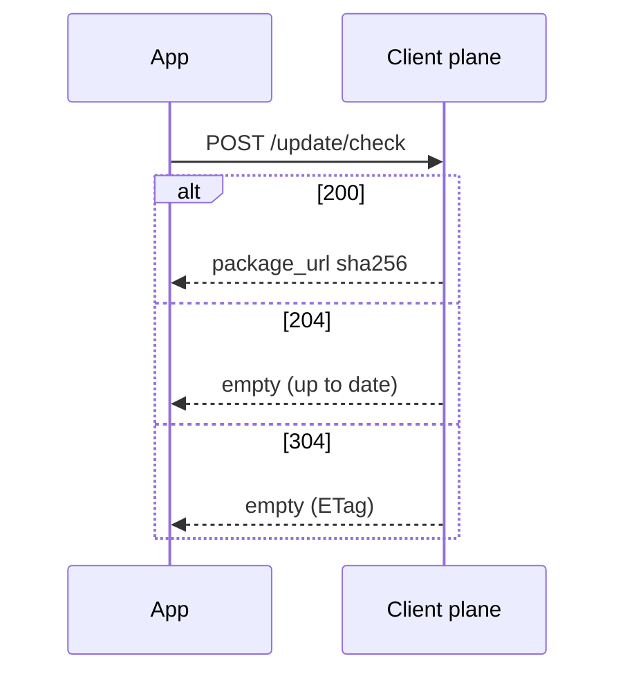

# Update check

**Update check** is the client-plane call that asks whether a safe install target exists. The server does not push to devices.

## When to use

Native clients, official SDKs, and headless services use this API. Electron / Sparkle / Tauri updaters read a listing feed instead; see [Store listings](./store).

## Configuration entry

- Console: project **Settings** (minimum supported version, rate limits, **Require client token for checks**); version channel / gray / critical flags. Click-path: [Versions](/en/admin/projects/versions).
- YAML: no global poll interval. Plane bind address: [client.yaml](/en/guide/config/client.yaml).

## Rules and error codes

Clients **POST** `/api/v1/projects/{project_ref}/update/check`. GET on the same path is 404 <ErrorCode code="NOT_FOUND" />.

| Condition | HTTP | Code |
|-----------|------|------|
| Unknown `current_version` | 404 | <ErrorCode code="VERSION_NOT_FOUND" /> |
| Revoked with no safe fallback | 409 | <ErrorCode code="NO_SAFE_TARGET" /> or <ErrorCode code="VERSION_REVOKED" /> |
| Min-source hop failed | 409 | <ErrorCode code="INTERMEDIATE_UNAVAILABLE" /> |
| Current line min OS/API unmet | 409 | <ErrorCode code="MIN_OS_NOT_MET" /> |
| Too frequent | 429 | <ErrorCode code="RATE_LIMITED" /> (`Retry-After`) |
| Line not preheated | 404 | <ErrorCode code="VERSION_NOT_VISIBLE" /> |

A wrong `X-Channel-Token` is **not** 403: that hidden channel is skipped. No update is **204**; ETag hit is **304**. Neither is a failure. Check is `Cache-Control: private` by default and must not be a public CDN object. See [CDN](./cdn).

## Client duties

1. Check **once at process start**, then on the product’s own schedule. There is no product-defined interval.
2. The app generates and stores `device_id` (gray depends on it). SDKs do not mint device identity.
3. Default `capabilities` is only `full_package`. Do not advertise `binary_delta` without a Patcher.
4. The body has **no** changelog text. Fetch changelog separately.

Schema: [API reference](/en/api/reference/) `openapi.client.json` (<a href="/en/api/scalar/client" target="_blank" rel="noopener">open Scalar</a>). Sequence: [Check HTTP](/en/api/client/check).

