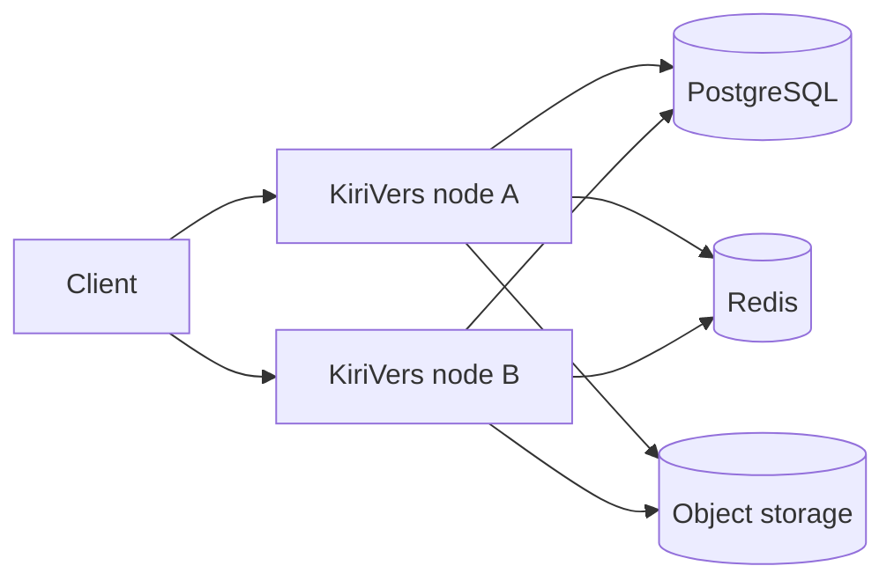

# Multi-node

Cluster mode is multiple KiriVers processes sharing one Postgres and object store.

## When to use

Scale downloads or admin horizontally. A single-disk install can stay one process.

## Configuration entry

Requires `storage.driver=s3` **and** `cache.driver=redis`. Otherwise `cluster.download` is ignored. YAML: [Cluster](/en/guide/config/cluster), [Redis](/en/guide/config/cache), [S3](/en/guide/config/s3). Console: [Nodes](/en/admin/nodes).

## Rules

| `cluster.download` | Behavior |
|--------------------|----------|
| `s3` | Public object URLs, CDN-friendly |
| `local` | Node proxy; check is also `private, no-store` |

`node.display_name` is a label only. Heartbeat writes Postgres; nodes do not report over HTTP.

## Client duties

Do not CDN-cache check under local-proxy. Download URLs remain SHA-256 objects.

