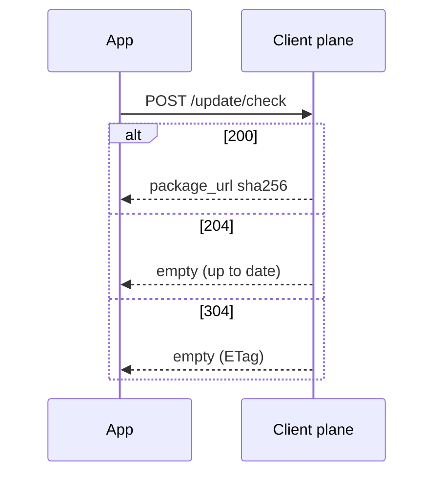

# 检查更新

**检查更新（check）** 是客户端向客户端平面询问「有没有可安装目标」的接口。服务端不向设备推送。

## 何时使用

自制客户端、官方 SDK、无 UI 服务进程都走本接口。Electron / Sparkle / Tauri 等商店更新器读 listing feed，见 [商店订阅](./store)，不调用本 POST。

## 配置入口

- 控制台：项目 **设置** 的最低支持版本、速率限制、**客户端检查需要 Token**；版本的渠道 / 灰度 / 关键标记。点击路径：[管理 · 版本](/admin/projects/versions)。
- YAML：无全局检查间隔。速率与 Token 见项目设置；平面地址见 [client.yaml](/guide/config/client.yaml)。

## 规则与错误码

客户端 **POST** `/api/v1/projects/{project_ref}/update/check`。同路径 GET 为 404 <ErrorCode code="NOT_FOUND" />。

| 条件 | HTTP | 码 |
|------|------|-----|
| 未知 `current_version` | 404 | <ErrorCode code="VERSION_NOT_FOUND" /> |
| 吊销且无安全回落 | 409 | <ErrorCode code="NO_SAFE_TARGET" /> 或 <ErrorCode code="VERSION_REVOKED" /> |
| 中继 hop 失败 | 409 | <ErrorCode code="INTERMEDIATE_UNAVAILABLE" /> |
| 当前线 min OS/API 未满足 | 409 | <ErrorCode code="MIN_OS_NOT_MET" /> |
| 过频 | 429 | <ErrorCode code="RATE_LIMITED" />（`Retry-After`） |
| 线未预热 | 404 | <ErrorCode code="VERSION_NOT_VISIBLE" /> |

错误 `X-Channel-Token` **不是** 403：只跳过该隐藏渠道。无更新 **204**；ETag 命中 **304**。二者都不是失败。check 默认 `Cache-Control: private`，不能当公共 CDN 缓存。见 [CDN](./cdn)。

## 客户端职责

1. 进程**启动时一次** + 按产品节奏周期轮询。间隔由应用决定；产品没有固定秒数。
2. 调用方生成并稳定保存 `device_id`（灰度依赖它）。SDK 不生成设备身份。
3. 默认 `capabilities` 仅 `full_package`。未注入差量应用器时不要报 `binary_delta`。
4. 响应**不含** changelog 正文。更新说明走独立 GET。

完整字段见 [API 参考](/api/reference/) 中的 `openapi.client.json`（<a href="/api/scalar/client" target="_blank" rel="noopener">新窗口打开 Scalar</a>）。时序：[API · 检查更新](/api/client/check)。

