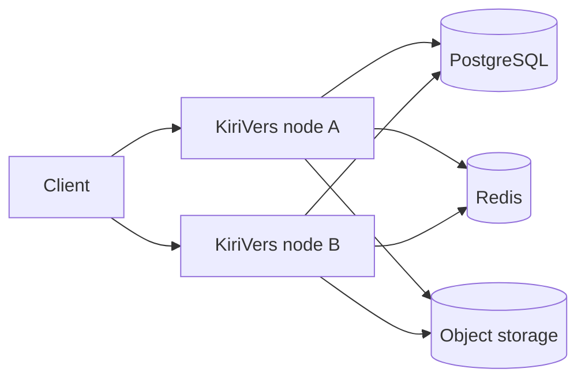

# 多节点

多个 KiriVers 进程共享同一 Postgres 与对象存储时进入集群模式。

## 何时使用

要水平扩展下载或管理时使用。单机磁盘部署保持单进程即可。

## 配置入口

必要条件：`storage.driver=s3` **且** `cache.driver=redis`。否则 `cluster.download` 不生效。YAML：[配置 · 多节点](/guide/config/cluster)、[Redis](/guide/config/cache)、[S3](/guide/config/s3)。管理台节点列表：[节点](/admin/nodes)。

## 规则

| `cluster.download` | 行为 |
|--------------------|------|
| `s3` | 公共对象直链，可走 CDN |
| `local` | 本机代拉；check 也 `private, no-store` |

`node.display_name` 仅显示名。心跳写库，节点不通过 HTTP 互报。

## 客户端职责

local-proxy 下不要把 check 当公共 CDN 缓存。下载 URL 仍是 SHA-256 对象。

